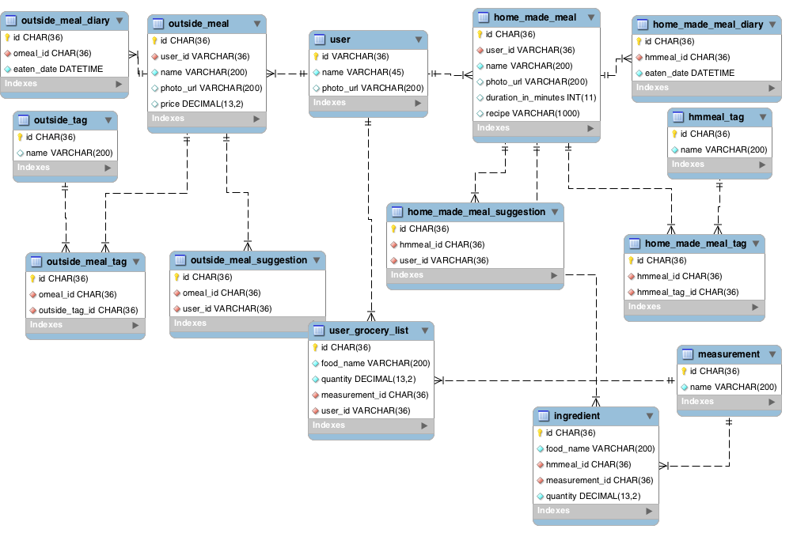

# WhatToEat Mobile Application Backend
## Project Description
WhatToEat is an iOS application that helps users to decide their daily meal selection with meal recommendations based on personally entered meals. Explore feature helps discovering new meal ideas. A meal entry can be home made or restaurant meal. The user can enter meals eaten by them everyday, so the app also serves as an eating journal. The user will be able to add tags for each meal so they can find their favorite meals based on their own words.

The main differentiator for this app is, users are free to manage their own favorite meals for cooking or ordering for a personalized experience.

## Technologies and Platforms
### Backend
**Application:** RESTful API using Spring boot  
**Application Hosting:** EC2 on AWS  
**Database:** MySQL  
**Database Hosting:** Amazon RDS  
**Dependency management:** Maven  
**Libraries:** JPA, Lombok, Google Single Sign-on  
**Source control:** Git  
**IDE:** IntelliJ  
### Front-End
**Language:** Swift 4  
**Dependency management:** CocoaPods  
**Libraries:** Google Single Sign-on  
**Source control:** Git  
**IDE:** Xcode 9.2  

## Backend Requirements   
- [x] HomeMadeMeal domain entity creation.  
- [x] CRUD implementation for HomeMadeMeal.
 - [x] GET all
 - [x] GET single
 - [x] POST for creation
 - [x] PUT for update
 - [x] DELETE single
- [x] Backend integration for fetching all home made meals.
- [x] Backend integration for saving a home made meal.
- [x] Creating database design with MySQLWorkbench Modeling.
- [x] Database connection needs to be set and db server needs to run on AWS.
- [x] Running backend API server on AWS.
- [x] Adding user id column to home made meals table DB.
- [x] User authentication Google single sign in (OAuth) and updating controllers to support multiple users.
- [ ] Adding OAuth token resolving cache to avoid external system calls for each API request.
- [ ] Outside meals list and CRUD operations implementation.
- [ ] Implementation of last eaten date and tag information in backend.
- [ ] Image host needs to be decided.
- [ ] New user first login sample meals and user on-boarding.

## Database Design:

## Solved Problems:
1.  Database credentials are confidential so these must not committed to git, so how to hide this information?  
**Solution:** Used export shell command to set environment variables for DB credentials. jdbc connection url, db credentials are changed to be read from environment variables in application.properties file.
2. How to avoid closing the backend application on the AWS when disconnecting SSH session?  
**Solution:** using tmux command to open a new session.
3. EC2 instance cannot connect to RDS instance via private network.  
**Solution:**
Added Security Group inside RDS to allow EC2 instance to connect by whitelisting private IP of EC2 instance.
